<h1 align="center">
  Book-Store Microservice
  <br>
</h1>

<p align="center">
  <a href="#built-with">Built With</a> •
  <a href="#architecture">Architecture</a> •
  <a href="#installation">Installation</a> •
  <a href="#endpoints">Endpoints</a> •
  <a href="#license">License</a>
</p>

## Features

- Feature 1
- Feature 2
- Feature 3

## Built With

- ![JavaScript][JS-badge]
- [![React][React-badge]][React-url]
- [![Vite][Vite-badge]][Vite-url]
- [![MUI][MUI-badge]][MUI-url]
- [![Stripe][Stripe-badge]][Stripe-url]

## Getting Started

Follow these instructions to set up the project locally.


## Installation

1. Clone the repository:

   ```bash
   git clone https://github.com/yourusername/your-repo-name.git
   ```

2. Navigate to the project directory:

   ```bash
   cd your-repo-name
   ```

3. Install the dependencies:

   ```bash
   npm install
   ```

4. Set up environment variables

   ```bash
   cp .env.example .env
   ```

## Running the Project

To start the development server, run:

```bash
npm run dev
```


## Building for Production

To create a production build, run:

```bash
npm run build
```

## Screenshots

### Homepage
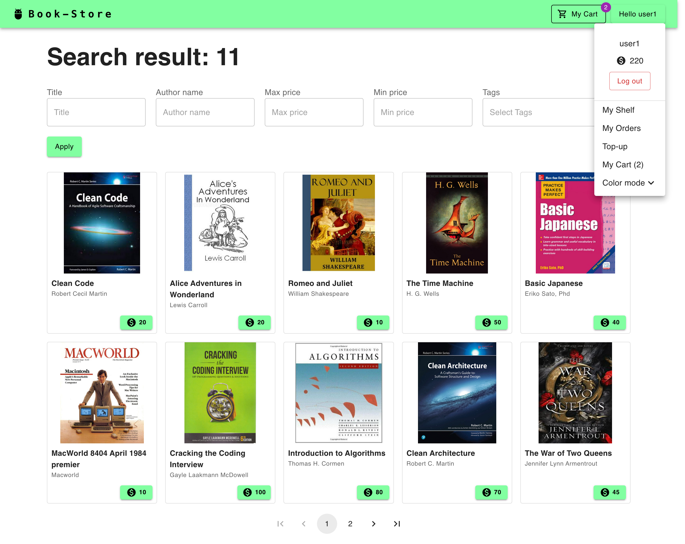

### Dark Mode Homepage
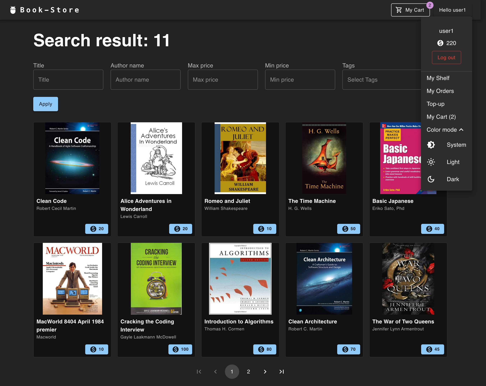

### Book Page
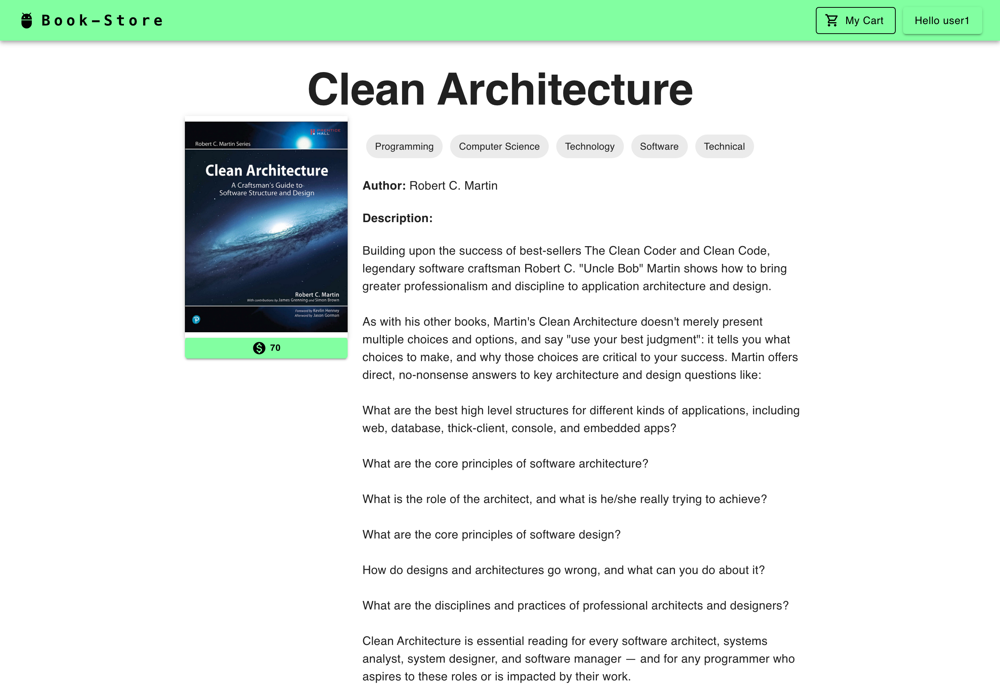

### Shelf
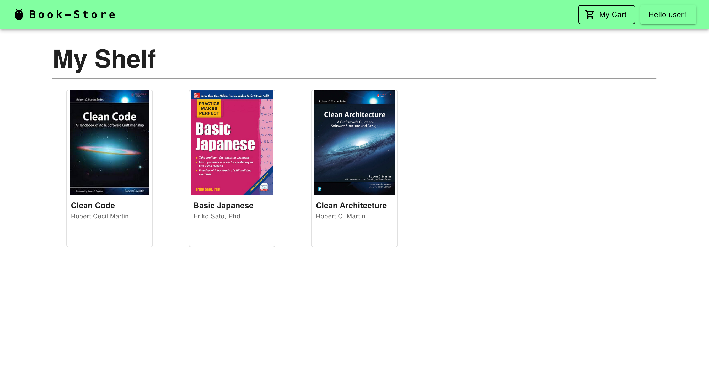

### Read Book
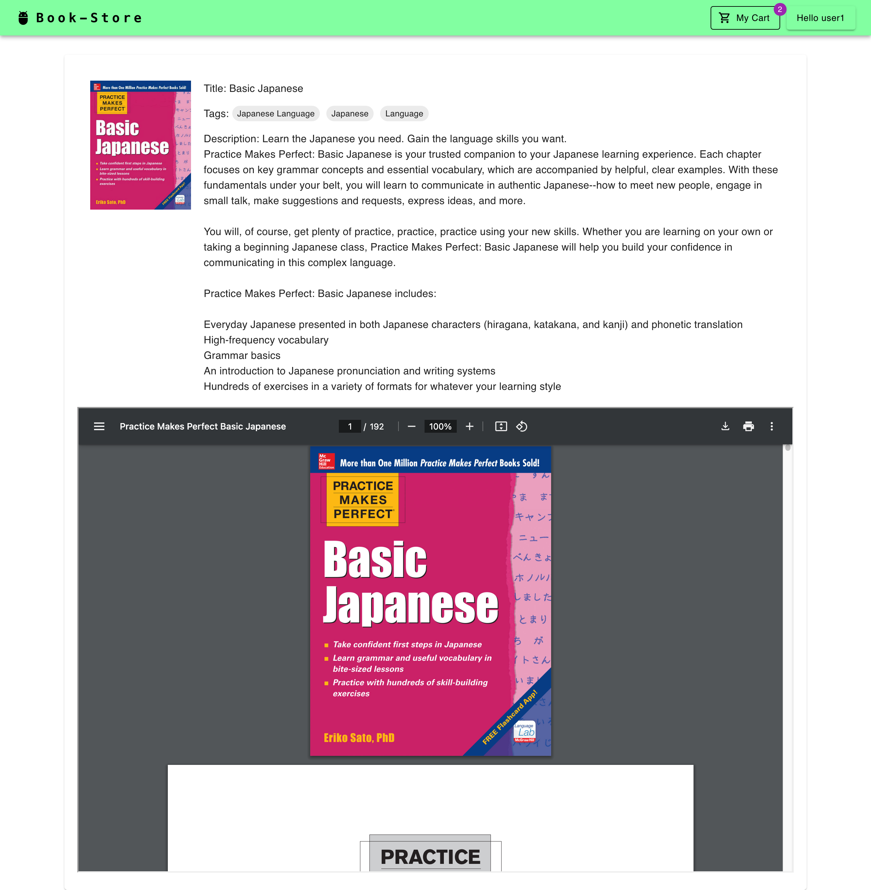

### Order
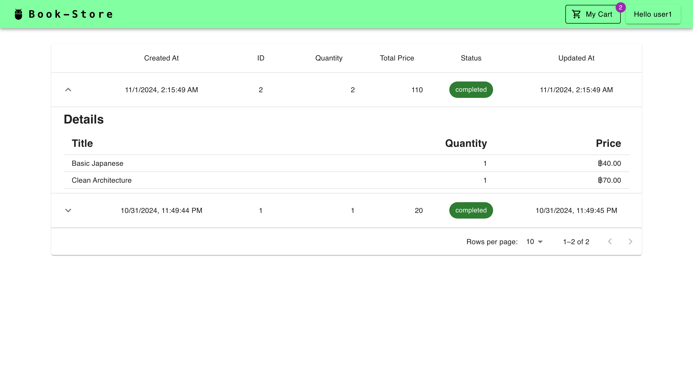

### Top-Up
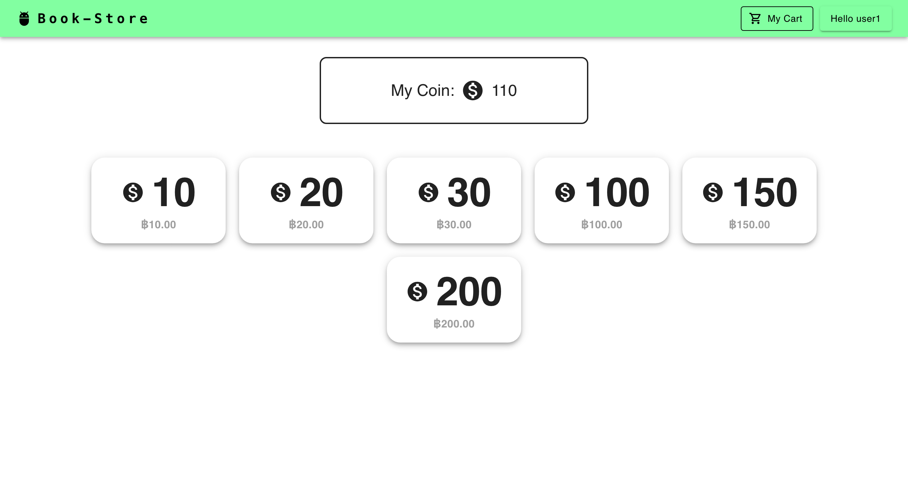

### Stripe Integration
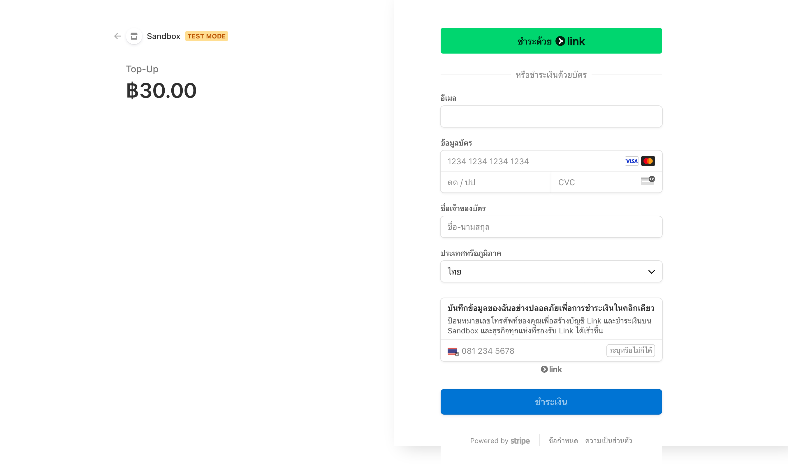

### Cart Page
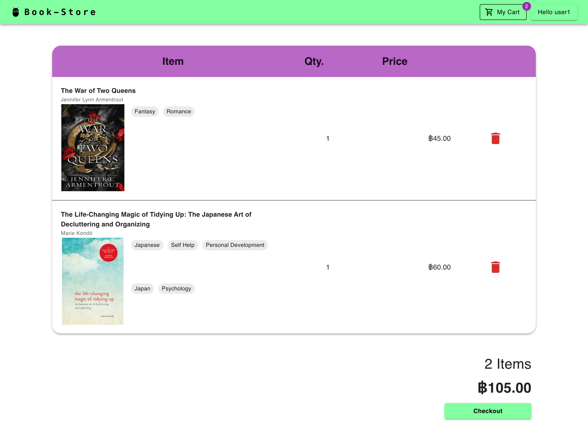

### User Transactions
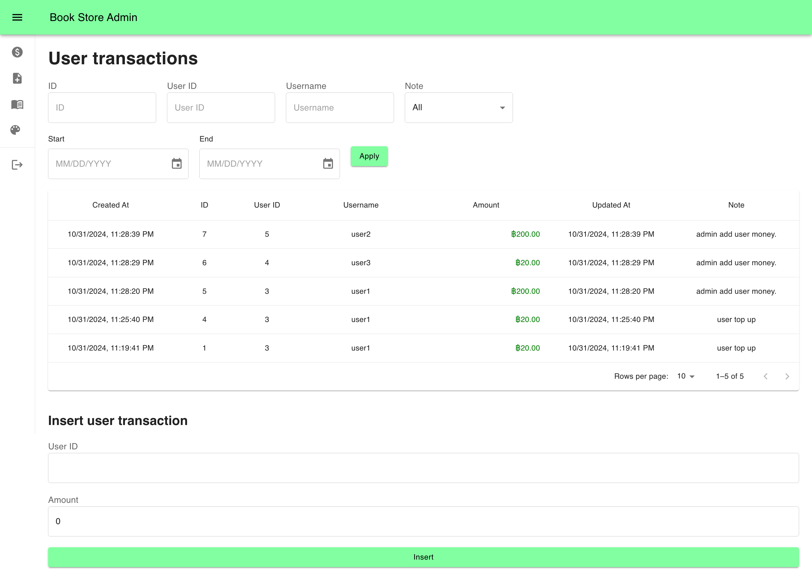

### User Transactions (Dark Mode)
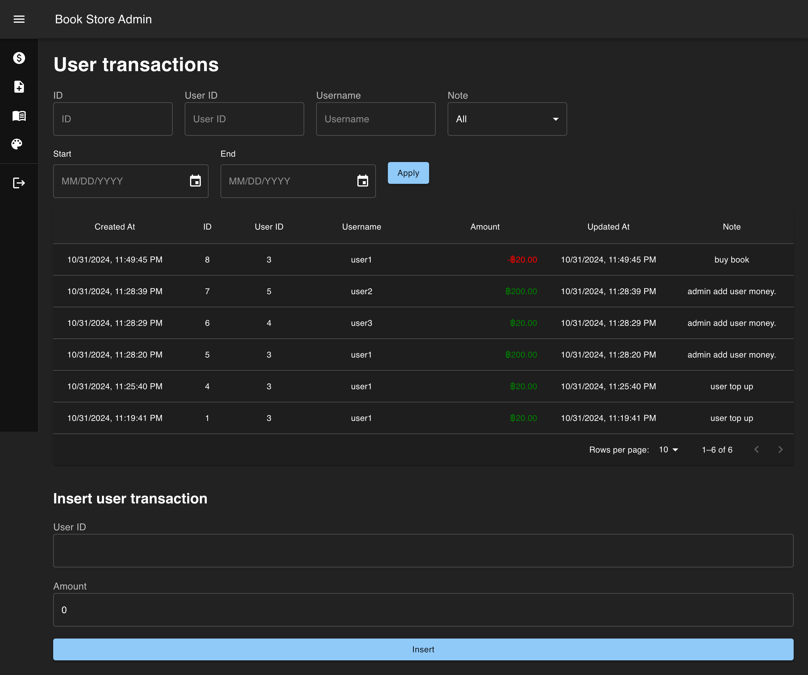

### Create Book
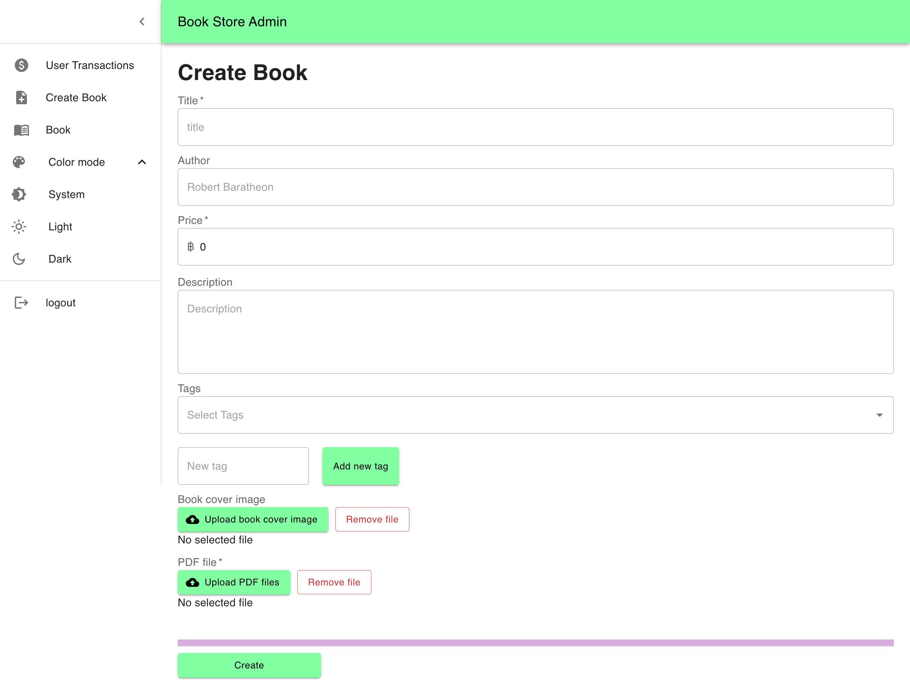

### Admin Book View
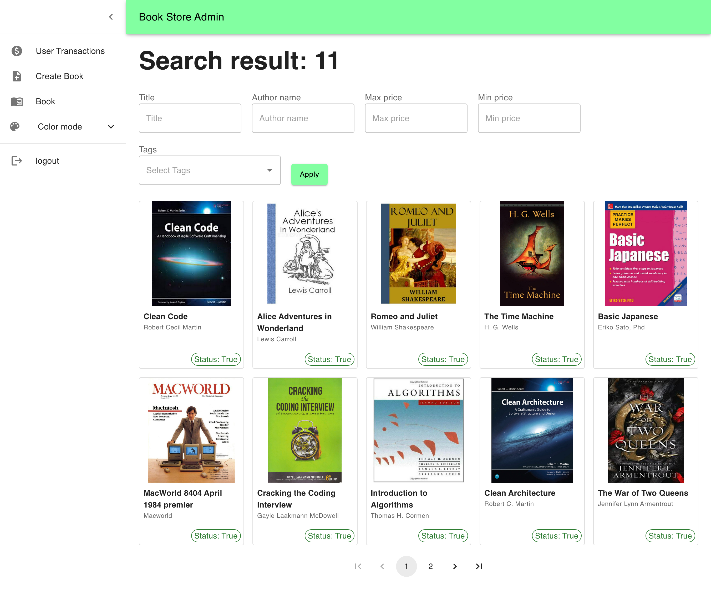

### Update Book
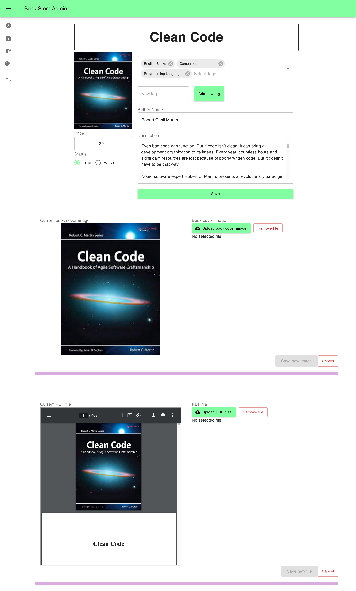


## License

This project is licensed under the MIT License. See the [LICENSE](LICENSE) file for details.


[JS-badge]: https://img.shields.io/badge/JavaScript-323330?style=for-the-badge&logo=javascript&logoColor=F7DF1E
[Vite-url]: https://vite.dev/
[Vite-badge]: https://img.shields.io/badge/Vite-B73BFE?style=for-the-badge&logo=vite&logoColor=FFD62E
[React-url]: https://react.dev/
[React-badge]: https://img.shields.io/badge/React-20232A?style=for-the-badge&logo=react&logoColor=61DAFB
[MUI-url]: https://mui.com/
[MUI-badge]: https://img.shields.io/badge/Material%20UI-007FFF?style=for-the-badge&logo=mui&logoColor=white
[Stripe-badge]: https://img.shields.io/badge/Stripe-626CD9?style=for-the-badge&logo=Stripe&logoColor=white
[Stripe-url]: https://stripe.com/
